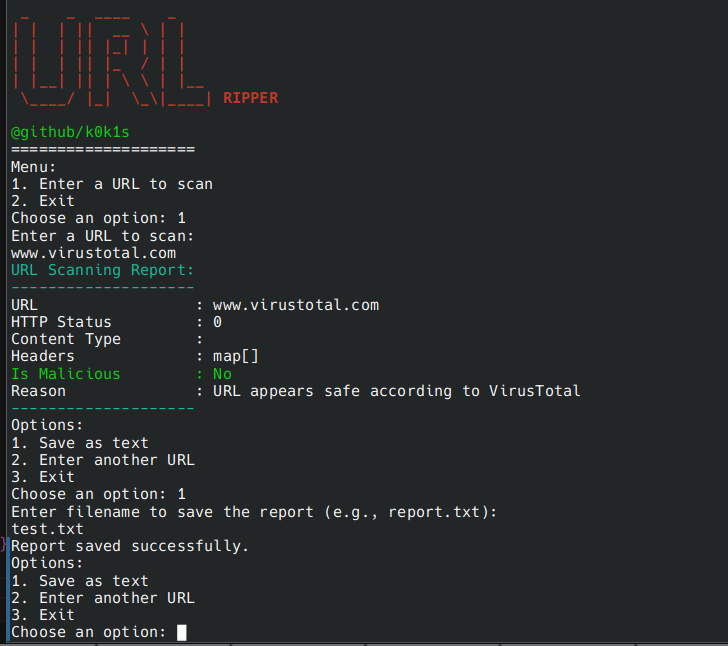

# URLRipper

URLRipper is a tool for scanning and analyzing URLs. It checks if URLs are malicious, provides detailed reports, and integrates with VirusTotal for additional URL reputation analysis.



## Getting Started

To get started with URLRipper, follow these steps:

### 1. Create the Project Directory

Create a new directory for your project and navigate into it:

```bash
mkdir urlripper
cd urlripper
```

### 2. Install Dependencies

Install the required Go packages. For this project, you need the `github.com/fatih/color` package:

```bash
go get github.com/fatih/color
```

### 3. Build or Run the Application

You can either build the application into an executable or run it directly.

#### To Build the Application

Build the Go application into an executable file:

```bash
go build -o urlripper
```

This will create an executable file named `urlripper` in your project directory.

Run the executable:

```bash
./urlripper
```

#### To Run the Application Directly

Alternatively, you can run the application directly without building it first:

```bash
go run main.go scanner.go virustotal.go report.go
```

### 6. API Key Configuration

Ensure that you replace `"YOUR_VIRUSTOTAL_API_KEY"` in `virustotal.go` with your actual VirusTotal API key.

## Example

Here’s a sequence of commands to get started:

```bash
mkdir urlripper
cd urlripper
go mod init urlripper
touch main.go scanner.go virustotal.go report.go
# (Paste the corresponding code into each file)
go get github.com/fatih/color
# Make sure to set your VirusTotal API key in virustotal.go
go build -o urlripper
./urlripper
```

??ENJOYY??c